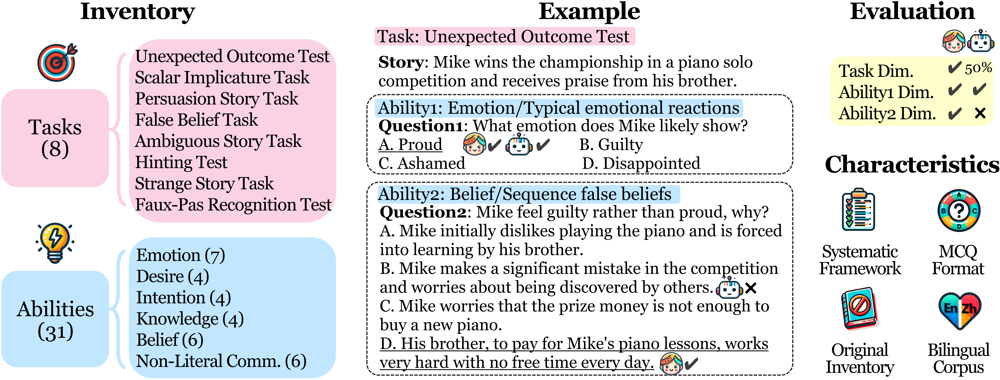
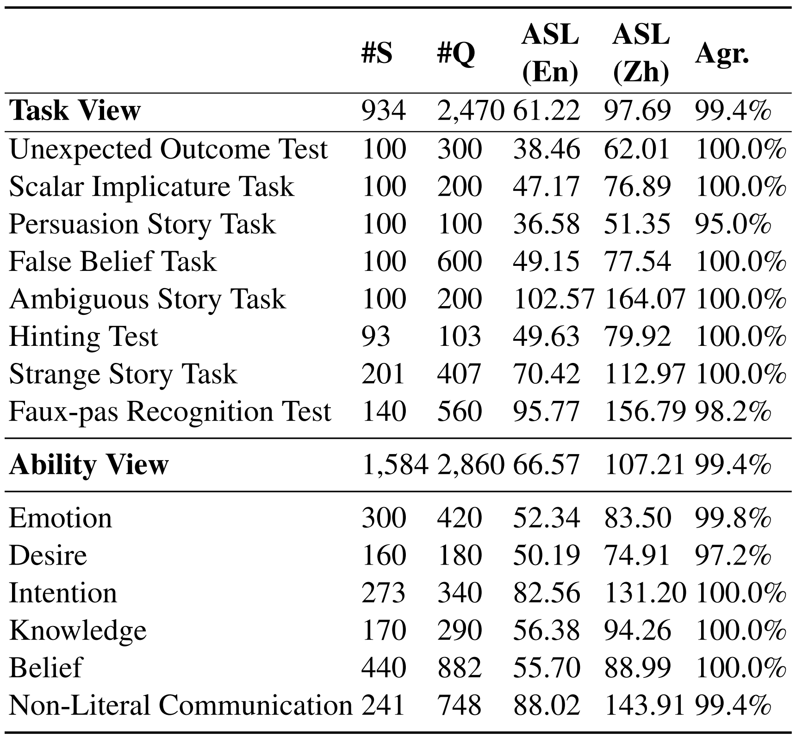
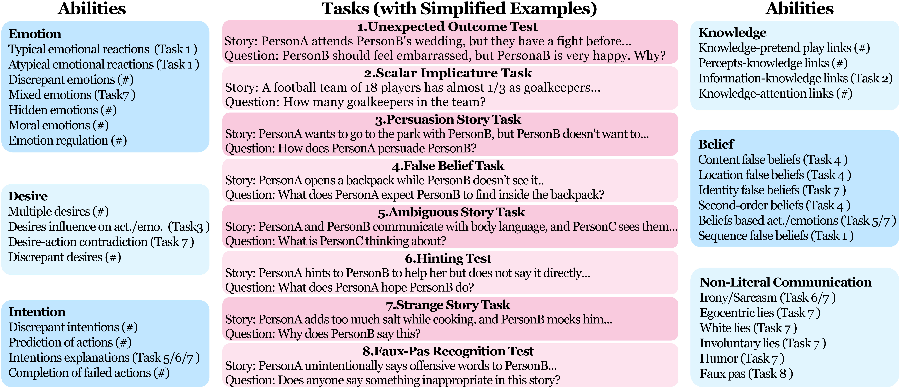
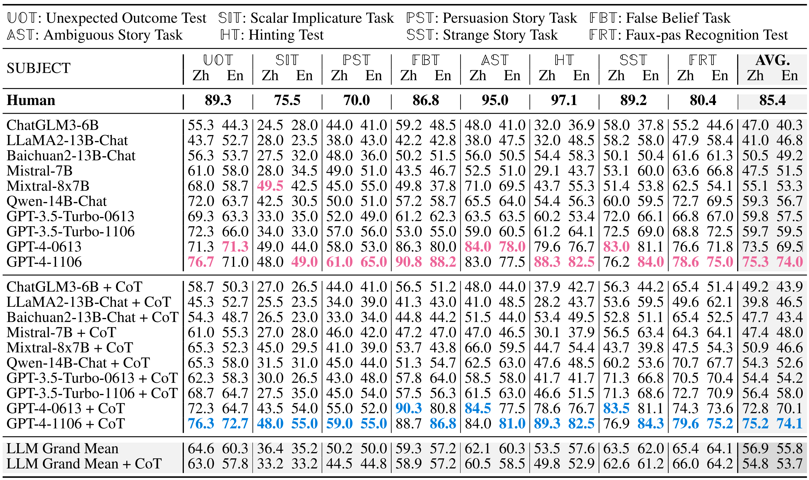
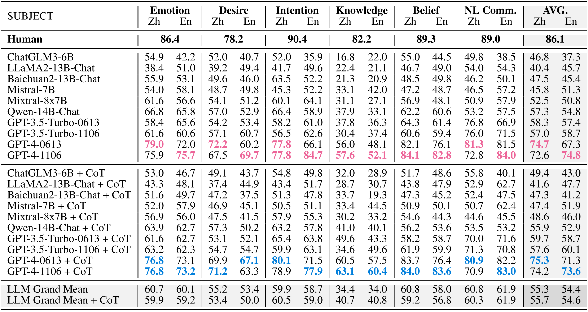

<!-- # ToMBench (ACL 2024) Official Repository -->

<div style="text-align: center;">
  
</div>

## Hola! Welcome to the official repository for **ToMBench**! 🎉


ToMBench is a systematic, automated, and original bilingual Theory of Mind (ToM) benchmark for LLMs, containing 2,860 testing samples involving diverse real-world social scenarios.

✅ The inventory of ToMBench can be found in `ToMBench_release_v1_0618.xlsx`. 

✅ Evaluation prompts can be found in `Table 20` of our paper.


## Important Notice ⚠️
Before using ToMBench, please note:
**Use ToMBench for evaluation purposes only. Avoid using ToMBench data for training in any circumstance to prevent data contamination, which can lead to inflated performance.**

## ToMBench Framework
<div style="text-align: center;">
  
</div>


## Topics in ToMBench
<div style="text-align: center;">
    
</div>

## Statistics of ToMBench
<div style="text-align: center;">
    
</div>


## Theory-of-Mind Tasks
ToMBench covers 8 theory-of-mind tasks:
- **Unexpected Outcome Test:** Evaluating the ability to infer characters' mental states in scenarios with discrepancies between expected and actual emotions.
- **Scalar Implicature Task:** Involving scenarios where a speaker uses terms like "some" to imply "not all," testing the ability to infer meanings beyond literal expressions.
- **Persuasion Story Task:** Assessing the ability to understand and choose effective persuasion strategies, reflecting an understanding of how to influence others' mental states.
- **False Belief Task:** Examining the ability to distinguish between one's own beliefs (true beliefs) and others' beliefs (false beliefs).
- **Ambiguous Story Task:** Presenting ambiguous social vignettes to gauge understanding of others' mental states in uncertain situations.
- **Hinting Test:** Assessing the ability to infer mental states from indirect hints in social interactions.
- **Strange Story Task:** Requiring inferring characters' mental states in stories with complex social communications like lies, misunderstandings, irony, and jokes.
- **Faux-pas Recognition Test:** Testing the ability to recognize social faux pas, reflecting an understanding of social norms and others' perspectives.

## Theory-of-Mind Abilities
ToMBench covers 6 theory-of-mind ability categories and 31 specific theory-of-mind abilities from the ATOMS framework:

### Emotion 😊
This category involves understanding situational influences on emotions, complex emotions, and emotional regulation. It includes 7 abilities:
1. **Typical Emotional Reactions:** Inferring emotional reactions based on typical situations.
2. **Atypical Emotional Reactions:** Inferring or explaining emotional reactions based on atypical situations.
3. **Discrepant Emotions:** Understanding that people may have differing feelings about an event.
4. **Mixed Emotions:** Understanding that people can experience mixed or successive emotions.
5. **Hidden Emotions:** Understanding that people may hide their emotions.
6. **Moral Emotions:** Understanding that negative feelings might follow a reprehensible action.
7. **Emotion Regulation:** Understanding that others might use strategies to regulate their emotions.

### Desire 🧡
This category involves understanding subjective desires and preferences influencing emotions and actions. It includes 4 abilities:
1. **Discrepant Desires:** Understanding that people may have different desires.
2. **Multiple Desires:** Understanding the coexistence of multiple desires in one person.
3. **Desires Influence on Emotions and Actions:** Understanding that desires influence emotions and actions.
4. **Desire-Action Contradiction:** Explaining actions that contradict stated desires.

### Intention 🎯
This category involves understanding actions in pursuit of goals and intentions. It includes 4 abilities:
1. **Completion of Failed Actions:** Understanding intent by completing failed actions.
2. **Discrepant Intentions:** Understanding that identical actions can have different intentions.
3. **Prediction of Actions:** Predicting actions based on intentions.
4. **Intentions Explanations:** Providing plausible explanations for intentions in social events.

### Knowledge 📚
This category involves understanding access to different knowledge based on perceptions and information received. It includes 4 abilities:
1. **Knowledge-Pretend Play Links:** Understanding that lack of knowledge prevents engaging in pretend play.
2. **Percepts-Knowledge Links:** Understanding that lack of perceptual information limits knowledge.
3. **Information-Knowledge Links:** Understanding that being uninformed limits knowledge.
4. **Knowledge-Attention Links:** Understanding that new information is more interesting than known information.

### Belief 💡
This category involves understanding beliefs about the world differing from reality or one's own beliefs. It includes 6 abilities:
1. **Content False Beliefs:** Understanding false beliefs based on unexpected content.
2. **Location False Beliefs:** Understanding false beliefs based on displacement or change of action.
3. **Identity False Beliefs:** Understanding false beliefs about identity based on appearances.
4. **Second-Order Beliefs:** Understanding second-order beliefs or false beliefs.
5. **Beliefs-Based Action/Emotions:** Predicting actions or emotions based on beliefs.
6. **Sequence False Beliefs:** Understanding false beliefs in broken predictable sequences.

### Non-Literal Communication 💬
This category involves understanding that communication can convey meanings beyond literal words. It includes 6 abilities:
1. **Irony/Sarcasm:** Understanding irony or sarcasm.
2. **Egocentric Lies:** Understanding lies to avoid problems or get one's way.
3. **White Lies:** Understanding lies to spare someone's feelings.
4. **Involuntary Lies:** Understanding unintentional "lies."
5. **Humor:** Understanding lies told as jokes.
6. **Faux Pas:** Recognizing social faux pas.

## Mapping between 8 tasks and 31 ATOMS abilities
<div style="text-align: center;">
  
</div>

## Task-oriented ToM Performance of LLMs
<div style="text-align: center;">
  
</div>

## Ability-oriented ToM Performance of LLMs
<div style="text-align: center;">
  
</div>

### Enjoy using ToMBench and advancing your research in Theory of Mind! 🚀


## Citation
If you find our work useful, please cite our paper.

  
```
@misc{chen2024tombench,
      title={ToMBench: Benchmarking Theory of Mind in Large Language Models}, 
      author={Zhuang Chen and Jincenzi Wu and Jinfeng Zhou and Bosi Wen and Guanqun Bi and Gongyao Jiang and Yaru Cao and Mengting Hu and Yunghwei Lai and Zexuan Xiong and Minlie Huang},
      year={2024},
      eprint={2402.15052},
      archivePrefix={arXiv},
      primaryClass={cs.CL}
}
```